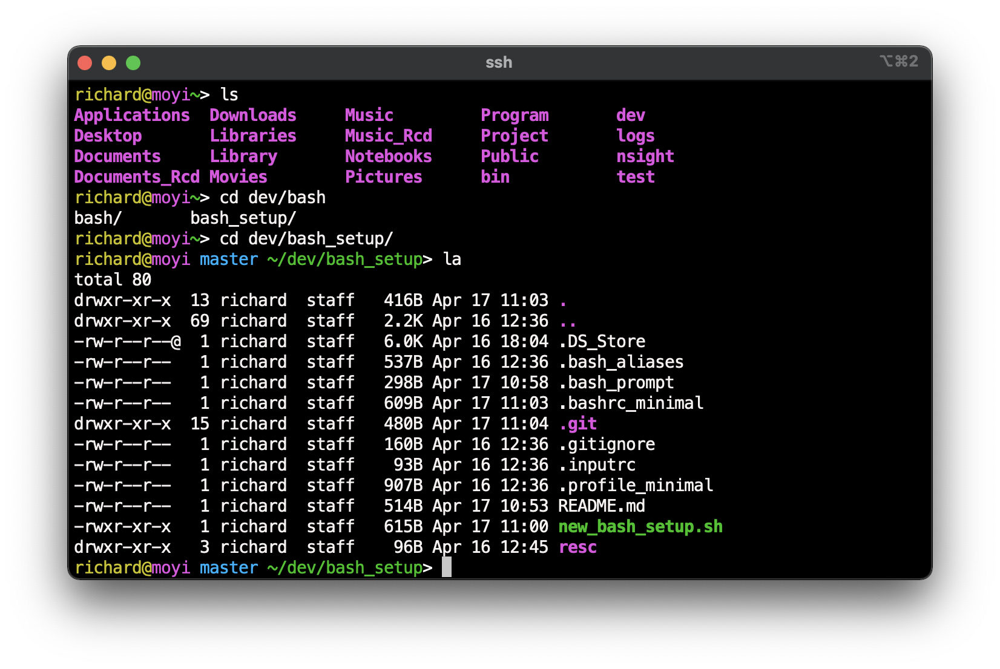

# Minimal bash setup

### Features
- Colorful
- Use `tab` to auto complete
- Use `up` and `down` to search history
- Customize aliases in seperate file `~/.bash_aliases`
- Show git branch if possible

### Screenshot


### Usage
```bash
git clone https://github.com/yueyericardo/bash_setup.git
cd bash_setup
# will backup your old ~/.bashrc files at ~/.bashrc.bak
source new_bash_setup.sh
# you may need to add few lines back to the new ~/.bashrc from the backed up one
```

### One Line Quick Setup
For example for Docker
```bash
source <(curl -L -s https://git.io/JZqht)
```
https://git.io/JZqht is shortlink for [bash.sh](https://raw.githubusercontent.com/yueyericardo/bash_setup/master/bash.sh).
